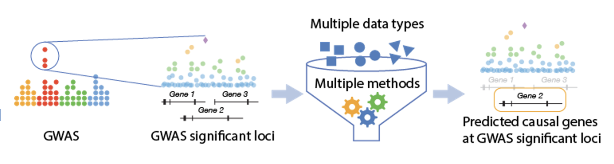

# Background

## 📖 Understanding Predicted Effector Genes (PEG)

### What are Predicted Effector Genes (PEG)?

When scientists run a genome-wide association study (GWAS), they often find many positions in the genome (variants) linked to a trait or disease. However, these variants usually don’t directly tell us which genes are involved in causing the disease. That’s because most GWAS signals fall in non-coding regions of DNA — regions that don’t directly code for proteins but may regulate nearby or distant genes.

**This gap has led to the “variant-to-function” (V2F) problem:**
- Which specific variant is causal at a GWAS locus?
- Which gene does that variant influence?
- And how does that gene’s altered activity contribute to disease?

### Why Predicted Effector Effector Genes matter:

- Variant → Phenotype: GWAS tells us that certain variants are statistically associated with a trait at the population level. But statistics alone don’t prove how the variant causes the phenotype.

- Gene → Phenotype: Experimental studies (e.g., in model organisms, cell lines, or small patient cohorts) can show that altering a gene changes the phenotype. This is stronger biological evidence, but often limited in scale.

Connecting a causal variant to its effector gene, and that gene to the phenotype, within a single table that integrates diverse lines of evidence and results from complex analyses, transforms population-level statistical signals into a mechanistic explanation of a trait. Because genes and their products are often the direct targets of drugs and therapies, they also provide the essential bridge for translating genetic discoveries into treatment.

### Why Standardised PEG Reporting Matters

Check out our  perspective paper Realizing the promise of genome-wide association studies for effector gene
prediction, [Costanzo et al. 2025](https://rdcu.be/eoqVk), for a more detailed explanation, but in brief:

1. **Diverse evidence and methods**
   
   Different studies use different types of evidence, methods, and presentation styles, making it difficult for readers to interpret and compare results.

2. **Poor visibility**

   Effector gene lists are often buried in supplementary tables, limiting their discoverability and blocking wider use.

3. **Inconsistent formats and weak annotation**
   
   Lack of standardized formats and insufficient provenance information makes the data opaque and hard to reuse.

4. **Limited trust due to difficult concordance assessment**
   
   Cross-study comparisons show only modest overlap (50–75%) in predicted effector genes. These inconsistencies undermine confidence and prevent the creation of “canonical” gene lists for downstream research.

5. **Reproducibility matters**
   
   For PEG lists to guide experiments or therapeutic development, different studies of the same trait. Standardized reporting makes it possible to compare PEG lists across studies, investigate why predictions differ, and use those insights to guide experimental validation and therapeutic development.

---

## 👥 About Us  

We are a community of researchers, data generators, data users, and repository maintainers working together to improve how Predicted Effector Genes (PEGs) are reported and shared. The effort is lead by a collaboration between the Knowledge Portal Network (based at the Broad Institute, Cambridge, MA, USA) and the NHGRI-EBI GWAS Catalog (based EMBL-EBI, Cambridge, UK). 

The aim of our working group is to define clear recommendations for PEG data reporting. This involves a series of community meetings and activities such as defining use cases, benchmarking datasets, and testing new approaches.  

For background and general recommendations, see our recent publication:  
[Realizing the promise of genome-wide association studies for effector gene prediction (Costanzo et al.)](https://rdcu.be/eoqVk)  

👉 To join the working group, please [contact us](mailto:help@kp4cd.org).  

## 🔧 Our Work  

We build a standard for reporting PEGs, with clear guidelines and examples that anyone can follow.  

More importantly, we listen to the needs of different groups, create standards that benefit users, strengthen the community, and update them as new methods and data emerge.  

---

## 📚 What You’ll Find in This Documentation  

1. [**Introduction**](./peg-overview.md)

   Learn what the [PEG Evidence Matrix](./peg-matrix/peg-matrix-intro.md), [PEG List](./peg-list.mdx), and [PEG Metadata](./peg-metadata/peg-metadata-intro.md) are, and how they fit together.  

2. **PEG Standards**  
   Detailed guidance and requirements for reporting PEGs.  
   - [PEG Evidence Matrix Standard](./peg-matrix/peg-matrix.md)  
   - [PEG Metadata Standard](./peg-metadata/peg-metadata.md)  
   - [PEG List Standard](./peg-list.md)  

3. **Community**  
   Explore community activities, workshops, and publications.  
   - [2025 Working Group](./community/workshop-2025.md)  
   - [2024 Workshop](./community/workshops-2024.md)
   - [Posters and Publications](./community/publications.md)

---

✨ *Ready to dive in? Start with the [Getting Started Guide](./peg-overview.md).*  
