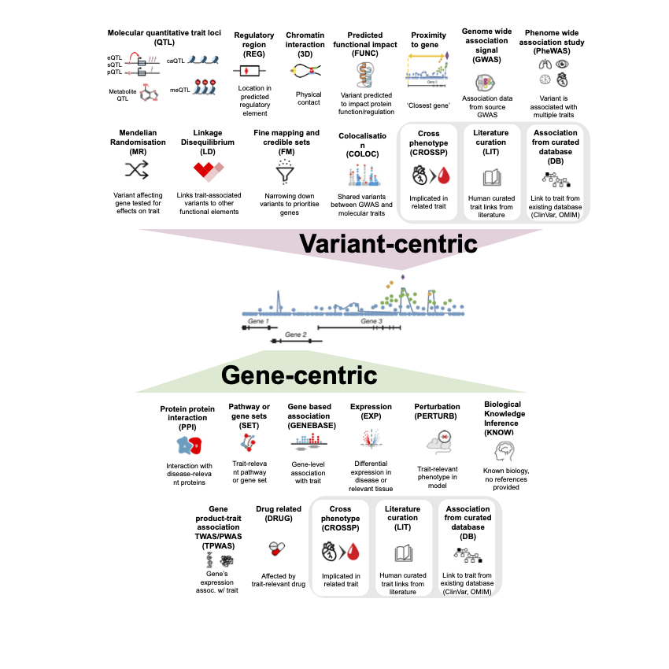

# PEG Evidence Categories

## 🌟 Why do we need PEG evidence categories?

Predicted Effector Gene (PEG) lists are built from **diverse sources of evidence**, ranging from genetic associations and computational predictions to functional assays and literature curation. Each source has its own origin, methodology, and level of confidence.

To ensure **clarity** and **interoperability**, PEGASUS group these diverse evidence types into **standardised categories** that are widely recognised in effector gene exploration.

➡️ Organising evidence into categories helps users:

* Interpret consistently – understand the general type of support behind each gene.
* Compare across studies – align evidence types, even when detailed sources differ.
* Build trust and transparency – see at a glance how predictions were made.

---
## PEG Evidence Categories

### 🔀 Variant-centric 🔀
| Evidence categories| Abbreviation | Explanation |
|-----------------------------------------|--------------|-------------|
| Linkage disequilibrium | LD | Assessment of whether variant is correlated with another variant of interest and may act as a proxy. | 
| Finemapping and credible sets | FM | Finemapping results -  probability of variant being causal within a credible set, using Bayesian or probabilistic models | 
| Colocalisation | COLOC | Variant affects two traits (typically a complex trait and a molecular phenotype) at the same locus. |
| Molecular QTL | QTL | Variant affects a molecular phenotype, e.g. gene expression (eQTL), splicing (sQTL), or protein expression (pQTL). |
| Mendelian Randomization (MR) | MR | Uses genetic variants as proxies for exposures to test their causal effect on outcomes.|
| Regulatory region | REG | Variant lies in open chromatin or enhancer/promoter elements in relevant tissue (e.g. ATAC-seq, DNase-seq, or histone mark data) |
| Chromatin interaction | CHROMATIN | Variant lies in a region physically interacting with a gene promoter via 3D chromatin architecture (e.g. Hi-C, Capture-C data). |
| Predicted functional impact | FUNC |  Variant predicted to disrupt gene/protein function or regulatory motifs, e.g. via SIFT, PolyPhen, CADD. | 
| Proximity to gene (distance) | PROX | Assessment of whether variant is within or near gene boundaries. |
| Genome-wide association (GWAS) signal | GWAS | P-value from source GWAS for association of variant with trait specified in metadata file |
| PheWAS (Phenome-Wide Association Study) | PHEWAS | Variant is associated with multiple traits, suggesting pleiotropic effects |

### 🧬 Gene-centric 🧬

| Evidence categories| Abbreviation | Explanation |
|-----------------------------------------|--------------|-------------|
| Protein–protein interaction | PPI | Gene’s protein interacts with other disease-relevant proteins. |
| Pathway or gene sets | SET | Gene is part of a known pathway or complex relevant to the phenotype, e.g. results of enrichment analyses using Reactome or KEGG. |
| Gene-based association | GENEBASE | Aggregated analysis of association of variants in gene with trait  (e.g. SKAT, MAGMA, burden tests) . |
| Expression | EXP | Gene is differentially expressed in relevant tissue or disease e.g. the gene is more highly expressed in phenotype-related tissues compared to others. |
| Perturbation | PERTURB | Gene perturbation causes phenotype-relevant effects in lab or model organisms (knock out animal/cell line, human organoid). |
| Biological Knowledge Inference | KNOW | Gene–phenotype relationships can be inferred based on known biology, without providing specific references or direct experimental evidence linking the specific gene to the phenotype.  |
| Genetically predicted trait association (TWAS/PWAS) | TPWAS | Evidence from transcriptome- or proteome-wide association studies showing that gene’s genetically predicted expression or protein level is associated with phenotype,  |
| Drug related | DRUG | Evidence from drug mechanism of action, e.g. gene encodes a known drug target or interacts with targets of drugs used to treat the phenotype, supporting therapeutic relevance. |

### Variant or Gene centric evidence
| Evidence categories | Abbreviation | Explanation | 
|-----------------------------------------|--------------|-------------|
| Cross-phenotype | CROSSP | Gene or variant already established in a related phenotype (biologically similar). |
| Literature curation | LIT | Human-curated gene or variant–disease links from literature. |
| Association from curated database | DB | Variant or Gene is curated as causal or related to the phenotype from existing database, like ClinVar, ClinGen, OMIM, etc. |
