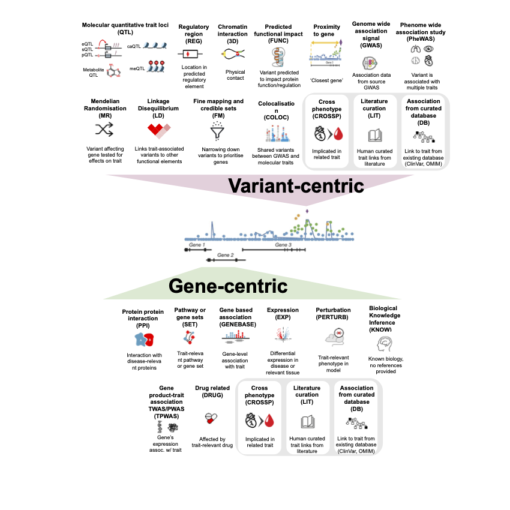

# PEGASUS Evidence Categories

## 🌟 Why do we need PEG evidence categories?

Predicted Effector Gene (PEG) lists are built from **diverse sources of evidence**, ranging from genetic associations and computational predictions to functional assays and literature curation. Each source has its own origin, methodology, and level of confidence.

To ensure **clarity** and **interoperability**, PEGASUS group these diverse evidence types into **standardised categories** that are widely recognised in effector gene exploration.

➡️ Organising evidence into categories helps users:

* Interpret consistently – understand the general type of support behind each gene.
* Compare across studies – align evidence types, even when detailed sources differ.
* Build trust and transparency – see at a glance how predictions were made.

---
## PEGASUS Evidence Categories

### 🔀 Variant-centric 🔀
| Evidence categories| Abbreviation | Explanation |
|-----------------------------------------|--------------|-------------|
| Linkage disequilibrium | LD | Variant is highly correlated with another variant and may act as a proxy. | 
| Finemapping and credible sets | FM | Finemapping results, or variant is in a credible set with high posterior probability of being causal. | 
| Colocalisation | COLOC | Variant affects multiple traits (e.g. a complex trait and gene expression data) at the same locus. |
| Molecular QTL | QTL | eQTL, sQTL, pQTL. Variant affects gene expression or splicing or protein level. |
| Mendelian Randomization (MR) | MR | Uses genetic variants as proxies for exposures to test their causal effect on outcomes.|
| Regulatory region | REG | Variant lies in open chromatin or enhancer/promoter elements in relevant tissue. |
| Chromatin interaction | 3D | Variant physically contacts gene promoter via 3D structure. |
| Predicted functional impact | FUNC | Variant predicted to disrupt gene/protein function or regulatory motifs. | 
| Proximity to gene (distance) | PROX | Variant is located within or near gene boundaries. |
| Genome-wide association (GWAS) signal | GWAS | P-value from source GWAS for association of variant with trait specified in metadata file. |
| PheWAS (Phenome-Wide Association Study) | PHEWAS | Variant is associated with multiple traits — may reveal pleiotropic effects. |

### 🧬 Gene-centric 🧬

| Evidence categories| Abbreviation | Explanation |
|-----------------------------------------|--------------|-------------|
| Protein–protein interaction | PPI | Gene’s protein interacts with other disease-relevant proteins. |
| Pathway or gene sets | SET | Gene is part of a known pathway or complex relevant to the phenotype. |
| Gene-based association | GENEBASE | Gene-based analysis of association of variants (common or rare) in gene with trait. |
| Expression | EXP | Gene is differentially expressed in relevant tissue or patients. e.g. the gene is highly expressed in phenotype-related tissues than others |
| Perturbation | PERTURB | Gene perturbation causes phenotype-relevant effects in lab or model organisms (knock out animal/cell line, human organoid). |
| Biological Knowledge Inference | KNOW | Gene–phenotype relationships can be inferred based on known biology, even when there is no direct genetic or experimental evidence linking the specific gene or variant to the new phenotype. No references are provided. |
| Genetically predicted trait association (TWAS/PWAS) | TPWAS | Gene’s genetically predicted expression or protein level is associated with phenotype. Transcriptome- or proteome-wide assocation studies |
| Drug related | DRUG | Gene is targeted by drugs known to treat or influence phenotype. |

### Variant or Gene centric evidence
| Evidence categories | Abbreviation | Explanation | 
|-----------------------------------------|--------------|-------------|
| Cross-phenotype | CROSSP | Gene or variant already established in a related phenotype (biologically similar). |
| Literature curation | LIT | Human-curated gene or variant–disease links from literature. |
| Association from curated database | DB | Variant or Gene is curated as causal or related to the phenotype from existing database, like ClinVar, ClinGen, OMIM, etc. |
