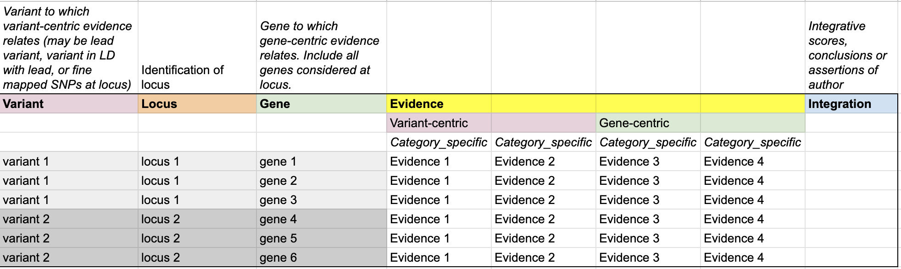

# 📖 PEG Evidence Matrix Introduction

## What is the PEG Evidence Matrix?

A PEG Evidence Matrix is the complete, machine-readable table underlying PEG prioritisation.
It includes:

* **All** genes considered at **each** selected GWAS locus
* **Unfiltered** values from the relevant evidence categories (not just top-priority genes)

The matrix is designed for **pipelines**, **re-weighting**, **benchmarking**, and **cross-study comparison**.

## PEG Evidence Matrix Requirements
The following standards define the minimal requirements for a PEG Matrix:

1. **ONE trait per PEG matrix**  
      &nbsp;&nbsp;&nbsp;&nbsp;- Each matrix corresponds to a single trait or phenotype.  

2. **ONE source GWAS per PEG matrix**  
      &nbsp;&nbsp;&nbsp;&nbsp;- Anchored to a clearly defined GWAS dataset (ideally identified by GWAS Catalog accession ID).
 

3. **ONE PEG matrix**  
      &nbsp;&nbsp;&nbsp;&nbsp;- Provided in a **machine-readable** format (e.g. tab-delimited (TSV); avoid styled or proprietary formats).  

4. **ALL genes at each locus**  
      &nbsp;&nbsp;&nbsp;&nbsp;- Include evidence for every gene considered, not just the top candidate(s).

## PEG Evidence Matrix Suggestions (Best Practices)
In addition to the **MUST FOLLOW** standards above, the following suggestions are recommended to improve interoperability and interpretability of PEG matrices:

1. Evidence summary per gene (author’s conclusion) 
&nbsp;&nbsp;&nbsp;&nbsp;-  Provide a cumulative “weight of evidence” score or summary statistic. This must be provided if the Matrix is to be represented as a PEG List.

2. Standard identifiers 
&nbsp;&nbsp;&nbsp;&nbsp;- Use HGNC gene symbols and include Ensembl Gene IDs for unambiguous cross-referencing.

3. Avoid evidence double-counting 
&nbsp;&nbsp;&nbsp;&nbsp;- When using automated pipelines that integrate multiple evidence sources (e.g., DEPICT, Open Targets), document which sources are included. 
&nbsp;&nbsp;&nbsp;&nbsp;- Do not count the same evidence type in one integration analysis twice.
___

## PEG Evidence Matrix Overview

The PEG Evidence Matrix brings together information on genetic **variants**, **locus**, and **genes**, alongside the **multiple streams of evidence** that connect them. It also includes **integrative analyses** that based on multiple evidence, as well as **a column for conclusions drawn**. The structure is designed to make relationships between entities clear and to enable side-by-side comparison of evidence from different sources.

- Variant – Identifies the variant(s) under consideration.
- Locus – Groups variants into locus to provide genomic context.
- Gene – Lists all candidate genes at a locus that are assessed with supporting evidence.
- Evidence – Captures both variant-centric and gene-centric evidence. Evidence is organised into category-specific fields, enabling systematic comparison across genes and loci.
- Integration – Records integrative scores, assertions, or conclusions, combining multiple evidence types into higher-level interpretations.

Together, these components provide a structured and transparent framework for linking genetic signals to potential effector genes, while ensuring the underlying evidence remains visible, comparable, and reproducible.

## PEG Evidence Matrix Standard Content

A PEG Evidence Matrix is composed of three major column sections. Together, these define the identifiers, raw evidence, and integrated results for each gene–locus–variant relationship.

### Genomic Identifier
Columns that define which variant, locus, and gene are being studied in each row. These provide the unique indexing needed to anchor all evidence values.

1. [PEG Evidence Matrix Standard](./peg-matrix.md#genomic-identifier)
2. [PEG Metadata Standard](../peg-metadata/peg-metadata.md#genomic-identifier)

### Evidence
Columns that capture the values from individual evidence categories. Each evidence type should be represented in a structured, machine-readable way.
1. [PEG Evidence Matrix Standard](./peg-matrix.md#evidence--general-pattern)
2. [Evidence Columns Example](./peg-matrix-example.md#variant-centric-evidence-examples)
3. [PEG Metadata Standard](../peg-metadata/peg-metadata.md#evidence)
4. Metadata Example – Evidence

### Integration
Columns that provide summaries or combined scores across multiple evidence categories.
These fields make explicit how different sources were weighted, merged, or ranked to prioritise candidate genes.
1. [PEG Evidence Matrix – Integration](./peg-matrix.md#integration-evidence--general-pattern)
2. [Integration Columns Example](./peg-matrix-example.md#integration-evidence-examples)
3. [PEG Metadata Standard](../peg-metadata/peg-metadata.md#integration)
4. Metadata Example – Integration

---
* 🎠 [View PEG Matrix Toy Example](../peg-toy-example.md)