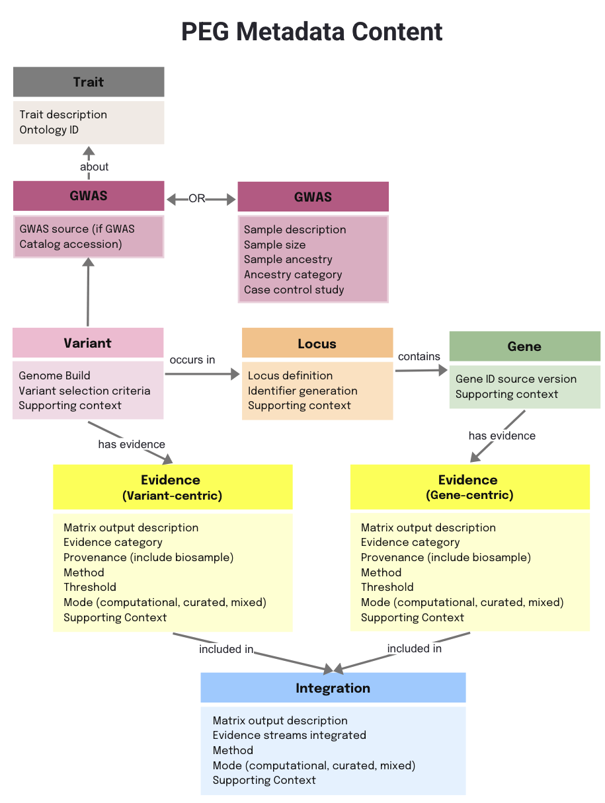
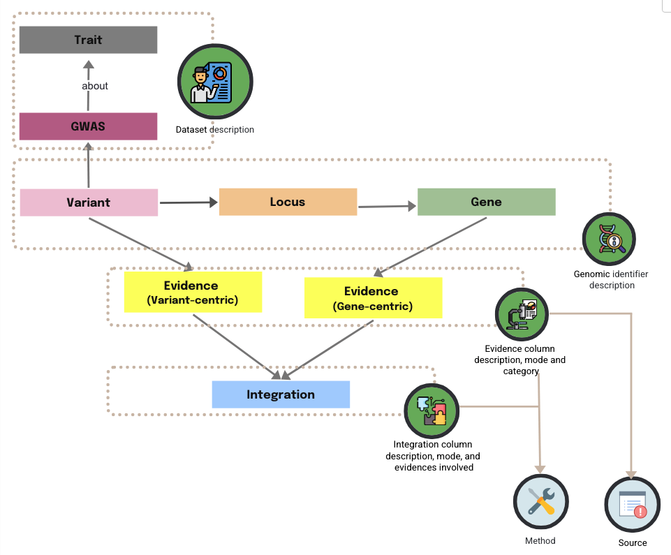

# 📖 PEG Metadata Introduction

## What is PEG Metadata?

Metadata is essential to help users understand, interpret, and reuse your data. It provides context for how the data was generated, processed, and interpreted, ensuring that your data is FAIR (Findable, Accessible, Interoperable, Reusable).

The PEG Metadata provides a structured description of the PEGASUS matrix. It:
- Defines the meaning of each column.
- Records the provenance of the underlying source data (including biosample information).
- Specifies the methods and pipelines used to generate each evidence type and the approaches used for integration.

# Principles of PEG Metadata
The PEG Metadata standard is guided by a set of high-level principles to ensure clarity, transparency, and interoperability:
- **Provenance** – metadata must include the GWAS from which the PEG list or matrix was derived, as well as the data source and analysis method for each evidence used to prioritise genes.
- **Consistency** – evidence types should use standardised terminology across studies.
- **Transparency** – criteria for significance (e.g., thresholds for QTLs, fine-mapping, colocalisation) should be explicitly stated if it is applicable.
- **Novelty** – metadata should specify whether de novo wet-lab evidence is included alongside computational or re-analysed evidence.
- **Methodology** – details of prioritisation, scoring, or ranking approaches must be documented.
- **Interoperability** – metadata capturing evidence provenance must follow a standardised structure to enable comparison across different PEG datasets.

Together, these principles ensure that PEG metadata not only documents the data itself, but also supports reproducibility, benchmarking, and community-wide use.

## PEG Metadata Schema

Each piece of evidence may be derived from external data (e.g. public databases or published articles) or generated from de novo experimental data. Capturing both the data source and the analysis method is therefore essential to help users understand the meaning of the evidence and to build confidence in its reuse.

For detailed information on the attributes for each entity, please refer to the [PEG Metadata Standard](./peg-metadata.md) page.

A single data source (e.g. GTEx bulk tissue expression data) can generate multiple pieces of evidences (e.g. gene expression patterns in different tissues), while the same method can be applied across multiple sources (e.g. FasteQTL applied to analysis GETx data or eQTLGen data). Modelling **source** and **method** as separate, reusable schema elements reduces duplication and supports consistent provenance, interpretability, and interoperability across PEG datasets.

Each `source` and `method` is defined by a unique identifier (source_tag and method_tag), which can be referenced consistently across the `evidence` and `integration` metadata.