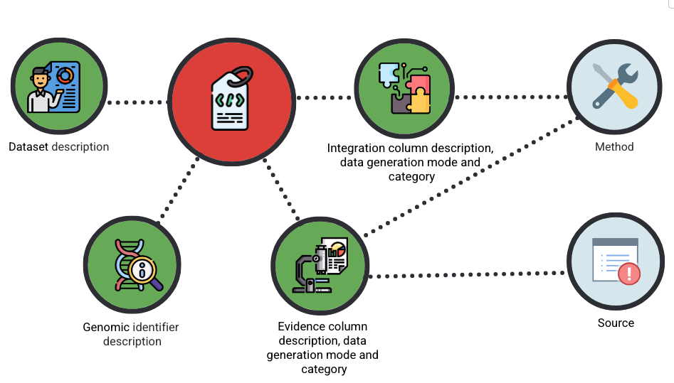

# 📖 PEGASUS Metadata Introduction

## What is PEGASUS Metadata?

Metadata is essential to help users understand, interpret, and reuse your data. It provides context for how the data was generated, processed, and interpreted, ensuring that your data is FAIR (Findable, Accessible, Interoperable, Reusable).

The PEGASUS metadata provides a structured description of the PEGASUS matrix. It:
- Defines the meaning of each column.
- Records the provenance of the underlying source data (including biosample information).
- Specifies the methods and pipelines used to generate each evidence type and the approaches used for integration.

# Principles of PEGASUS Metadata
The PEGASUS metadata standard is guided by a set of high-level principles to ensure clarity, transparency, and interoperability:
- Provenance – metadata must include the GWAS from which a PEG list or matrix was derived.
- Consistency – evidence types should use standardised terminology across studies.
- Transparency – criteria for significance (e.g., thresholds for QTLs, fine-mapping, colocalisation) should be explicitly stated if it is applicable.
- Completeness – metadata should specify whether de novo wet-lab evidence is included alongside computational or re-analysed evidence.
- Methodology – details of prioritisation, scoring, or ranking approaches must be documented.
- Interoperability – metadata for individual publications and pipeline-generated data should follow the same structure to allow integration across sources.

Together, these principles ensure that PEG metadata not only documents the data itself, but also supports reproducibility, benchmarking, and community-wide use.

## PEGASUS Metadata Schema

The metadata is the description on the data in the PEG Evidence Matrix and List— it explains what each column means, where the data comes from, how it was generated, and how it should be interpreted. 

Because the same **Source** and **Method** details can apply to **multiple evidence streams**, we have modularised them in the schema. Each source or method is defined once with a unique identifier, which can then be referenced across the Evidence and Integration tabs (in [a data entry form](https://docs.google.com/spreadsheets/d/1-qn2jM3Ptk-qdvotQkRAQZQ2tRHV7cvg2j6KFLrf5nM/edit?pli=1&gid=0#gid=0)).

The following diagram shows how the main entities’ metadata are presented together as a group (as a single tab in the Excel file), while **Method** and **Source** are kept separate to avoid duplication and improve reusability.

## PEGASUS Metadata Standard Overview

💡 For easy-to-fill information, we also provide an Excel view with 6 tabs (one per entity type), designed to capture and present these fields clearly.

:::tip
[📊 Download metadata google sheet template](https://docs.google.com/spreadsheets/d/1-qn2jM3Ptk-qdvotQkRAQZQ2tRHV7cvg2j6KFLrf5nM/edit?gid=0#gid=0)
:::

If you have questions about any attribute for each entity, we also provide detailed explanations [here](./peg-metadata.md). We are more than happy to hear from you — please feel free to contact us if you have further questions.

The PEG metadata is currently organised into six tabs. The diagram below shows a simplified view of their relationships.

Each entity contains fields that capture a different aspect of the dataset:

- [**Dataset description**](./peg-metadata.md#dataset-description) - descriptors for the whole PEG matrix (trait, source of the matrix itself, publication reference, release date, creator)
- [**Genomic Identifier**](./peg-metadata.md#genomic-identifier) – details about the variants, genes, or locus included in your dataset.
- [**Evidence**](./peg-metadata.md#evidence) – supporting data types and experimental or computational evidence that link variants to genes or traits.
- [**Integration**](./peg-metadata.md#integration) – information about how different streams of evidence are combined (e.g., scoring, weighting, prioritisation).
- [**Source**](./peg-metadata.md#source) – citation and provenance information for each evidence stream, including publications, databases, and biosample details.
- [**Method**](./peg-metadata.md#method) – a description of the methodology, pipelines, or softwares used to generate the data.
