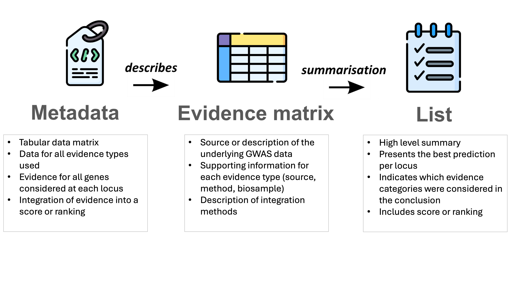

# PEGASUS Framework Overview
---

## Predicted Effector Gene Aggregation, Standards, and Unified Schema (PEGASUS) Framework

The PEGASUS Framework is a community standard for reporting predicted effector genes derived from genome-wide association studies (GWAS) and integrative evidence. It ensures that results are transparent, interoperable, and reusable.

Some high level principles of the PEGASUS standard include 
- Clearly identifying the underlying GWAS and indicating the relationship between sentinel variants, loci and effector genes.  
- Generating a single data table containing all evidence types and all loci investigated
- Providing supporting metadata for the analytical methods and all evidence considered to enable reproduction of the results. 
- Provision of clear definitions of data elements and use of standard identifiers and terminology throughout, to enable reproducibility. 
- Provision of a quantitative score for each locus-gene pair so that the final selection logic for effector genes is transparent and reproducible
- Presenting data in plain text format, not relying on graphics or visual styling, to support machine readability.  

To achieve these goals, PEGASUS defines three core modules: PEG Metadata, PEG Evidence Matrix and PEG List.

### PEG Evidence Matrix

- The full **tabular** dataset that links variants, loci, and genes as genomic identifiers with all supporting evidence. It includes evidence for all genes (not just top candidates) and may also contain integrated scores.

### PEG Metadata
  
- Provides the context needed to understand and reuse a PEG matrix, ensuring data are FAIR. It defines column meanings, records data provenance (e.g. biosamples), and specifies methods and integration approaches.

### PEG List

- A summarised output. It highlights the **best predictions** (top genes), shows which evidence was considered, and includes the **author’s conclusion**.

## PEG Evidence Matrix vs. PEG Metadata

* The **Evidence Matrix** is the data itself — a structured table of variants, genes, and all the evidence linking them. It is what you see and analyse.

* The **Metadata** is the description of that data — it explains what each column means, where the data originates, how the data was generated, and how it should be interpreted.

One without the other is incomplete; without the matrix, there is no information to work with; without the metadata, the matrix is hard to interpret and risks being misunderstood. Together, they ensure that PEG data is both rich in content and clear in meaning.

An analogy:
The PEG Evidence Matrix and PEG Metadata tell the same story, about the same actors, but from different perspectives. The matrix reveals what each actor does in the story, while the metadata describes their appearance and personality, adding depth and context to their role.

## PEG List vs. PEG Evidence Matrix

* The **Evidence Matrix** includes all the evidence for all the genes considered, and includes data for all evidence types used. It may or may not include integrations of different evidence streams.

* The **PEG List** is derived from the Evidence Matrix and represents a high level summarisation of the data, showing the top genes only. A PEG List must contain an author’s conclusion, which is an integration of evidence from the Evidence Matrix.

PEG lists:
* Are a concise summary distilled from the PEG Matrix.
* Highlight the top genes most likely causal for the phenotype.
* Summarise which evidence categories were considered, using broad and intuitive categories rather than detailed experimental designs.

**PEG Lists must be supported by an Evidence Matrix and described by Metadata.**
