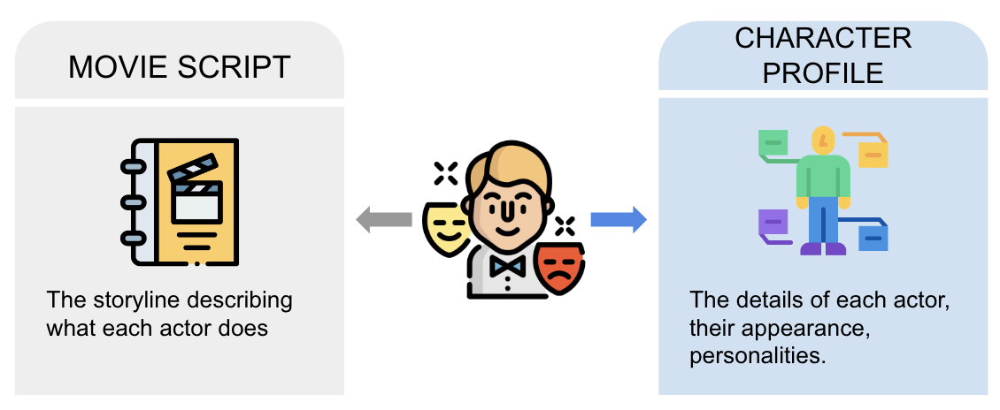

# Overivew
---

## PEG Evidence Matrix - PEG Metadata - PEG List

- PEG Evidence Matrix

  The full **tabular** dataset that links variants, loci, and genes as genomic identifiers with all supporting evidence. It includes evidence for all genes (not just top candidates) and may also contain integrated scores.

- PEG Metadata
  
  Provides the context needed to understand and reuse a PEG matrix, ensuring data are FAIR. It defines column meanings, records data provenance (e.g. biosamples), and specifies methods and integration approaches.

- PEG List

  A summarised output. It highlights the **best predictions** (top genes), shows which evidence was considered, and includes the **author’s conclusion**.

## PEG Evidence matrix V.S. PEG metadata

The PEG Evidence Matrix and PEG Metadata tell the same story, about the same actors, but from different perspectives. The matrix describes what each actor does in the story, while the metadata reveals their appearance and personality, adding depth and context to their role.

In practice:

* The matrix is the data itself — a structured table of variants, genes, and all the evidence linking them. It is what you see and analyse.
* The metadata is the description of that data — it explains what each column means, where the data originates, how the data was generated, and how it should be interpreted.

Think of the matrix as the content, and the metadata as the user guide. One without the other is incomplete:
- Without the matrix, there is no information to work with.
- Without the metadata, the matrix is hard to interpret and risks being misunderstood.
Together, they ensure that PEG data is both rich in content and clear in meaning.

## PEG Evidence matrix V.S. PEG list

The PEG Evidence Matrix is like a detailed sightseeing map of London.
- It shows all routes, side streets, walking paths, and even underground lines.
- It marks landmarks, hotels, rivers, and attractions — everything you might need to explore the area.

This corresponds to the full set of variants, locus, genes, and all evidence categories, including integrated analyses.

The PEG List is like choosing the best walking route for sightseeing.

- From all the possible paths on the map, you highlight the most reasonable route that satisfies your goals (e.g. the author’s criteria).

It focuses on the most likely causal genes, supported by the clearest evidence, and provides a concise summary.

## PEG Metadata V.S. PEG list

📖 **PEG Metadata** – Acts like a detailed manufacturer’s guide or instruction manual — available when you need to know how everything was designed and built.

- Provides the detailed context behind the PEG Matrix.  
- Defines each column, records provenance (e.g. biosamples), and specifies methods or pipelines used to generate each evidence stream.  

  

    💡 **PEG List** – Designed to be easy to read on its own — like flipping a light switch: you know how it works without needing to consult the manual. But the metadata (the manual) is always there if you want to dig deeper.  

    - A concise summary distilled from the PEG Matrix.  
    - Highlights the top candidate genes most likely causal for the phenotype.  
    - Summarises which evidence categories were considered, using broad and intuitive categories rather than detailed experimental designs.  
  

  

    
  

