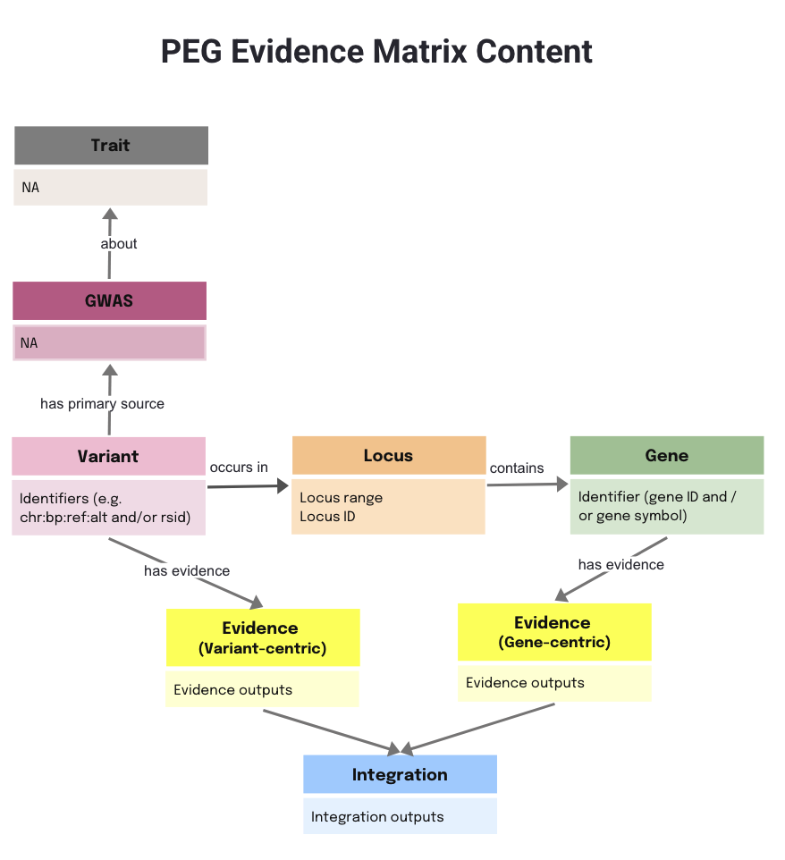
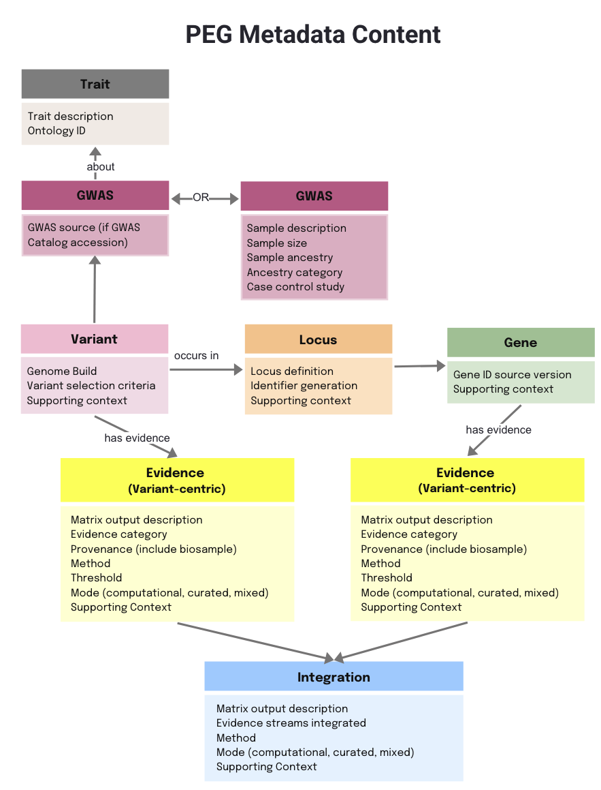
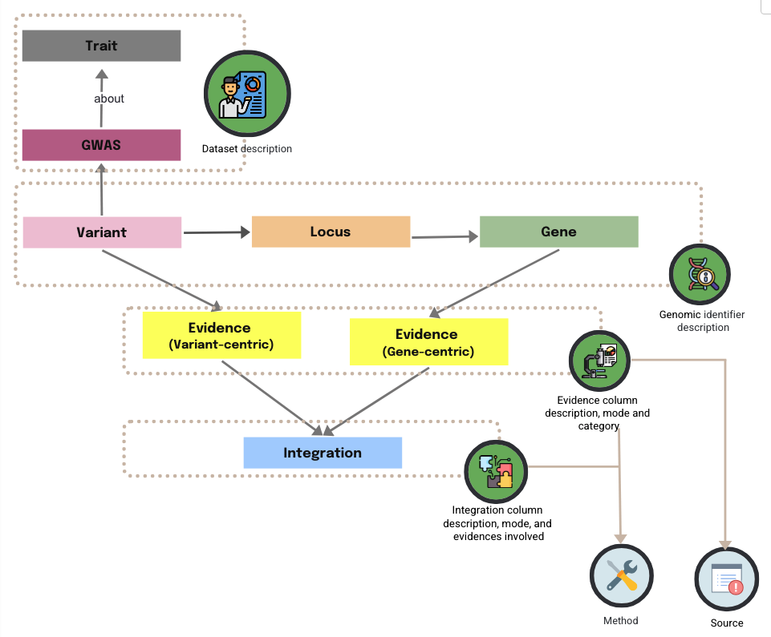
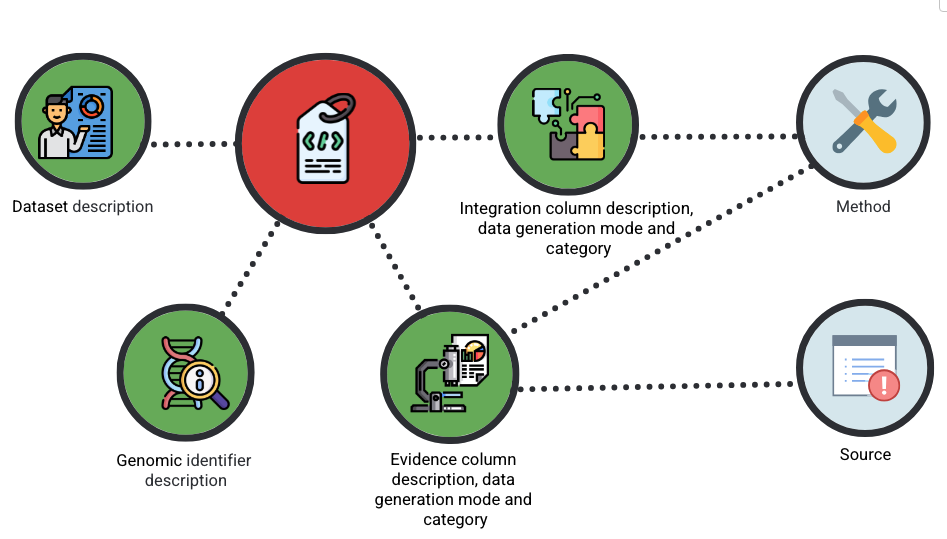

# PEG Metadata Standard Introduction

## What is the PEG Metadata?

Metadata is essential to help users understand, interpret, and reuse your data. It provides context for how the data was generated, processed, and interpreted, ensuring that your data is FAIR (Findable, Accessible, Interoperable, Reusable).

The PEG metadata provides a structured description of the PEG matrix. It:
- Defines the meaning of each column.
- Records the provenance of the underlying source data (including biosample information).
- Specifies the methods and pipelines used to generate each evidence type and the approaches used for integration.

# Principles of the PEG Metadata Standard
The PEG metadata standard is guided by a set of high-level principles to ensure clarity, transparency, and interoperability:
- Provenance – metadata must include the GWAS from which a PEG list or matrix was derived.
- Consistency – evidence types should use standardised terminology across studies.
- Transparency – criteria for significance (e.g., thresholds for QTLs, fine-mapping, colocalisation) should be explicitly stated if it is applicable.
- Completeness – metadata should specify whether de novo wet-lab evidence is included alongside computational or re-analysed evidence.
- Methodology – details of prioritisation, scoring, or ranking approaches must be documented.
- Interoperability – metadata for individual publications and pipeline-generated data should follow the same structure to allow integration across sources.

Together, these principles ensure that PEG metadata not only documents the data itself, but also supports reproducibility, benchmarking, and community-wide use.

## PEG Evidence Matrix and PEG Metadata

The PEG Evidence Matrix and the PEG Metadata are two sides of the same coin, describing the same content from different perspectives.

- The matrix is the data itself — a structured table of variants, genes, and the evidence linking them. It is what you see and analyse.

The metadata is the description on that data — it explains what each column means, where the data comes from, how it was generated, and how it should be interpreted.

Together, they ensure that the same information can be both analysed in detail and understood in context.

## From PEG evidence matrix to PEG metadata

The PEG Metadata Standard describes the same “main actors” as the PEG Evidence Matrix, but from a different perspective. To make the metadata easier to use and organise, its structure is **arranged** differently. 

Because the same **Source** and **Method** details can apply to **multiple evidence streams**, we modularised them into independent tabs. Each source or method is defined once with a unique identifier, which can then be referenced across the Evidence and Integration tabs.

The following diagram shows how the main entities’ metadata are presented together as a group (as a single tab in the Excel file), while **Method** and **Source** are kept separate to avoid duplication and improve reusability.

## PEG Metadata Standards Overview

The PEG metadata is currently organised into six tabs. The diagram below shows a simplified view of their relationships.

Each tab contains fields that capture a different aspect of the dataset:

- [**Dataset description**](./peg-metadata.md#dataset-description) - descriptors for the whole PEG matrix (trait, source of the matrix itself, publication reference, release date, creator)
- [**Genomic Identifier**](./peg-metadata.md#genomic-identifier) – details about the variants, genes, or locus included in your dataset.
- [**Evidence**](./peg-metadata.md#evidence) – supporting data types and experimental or computational evidence that link variants to genes or traits.
- [**Integration**](./peg-metadata.md#integration) – information about how different streams of evidence are combined (e.g., scoring, weighting, prioritisation).
- [**Source**](./peg-metadata.md#source) – citation and provenance information for each evidence stream, including publications, databases, and biosample details.
- [**Method**](./peg-metadata.md#method) – a description of the methodology, pipelines, or softwares used to generate the data.

## PEG Metadata Data Example