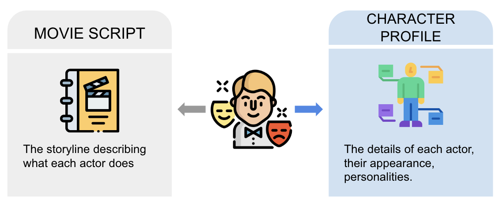
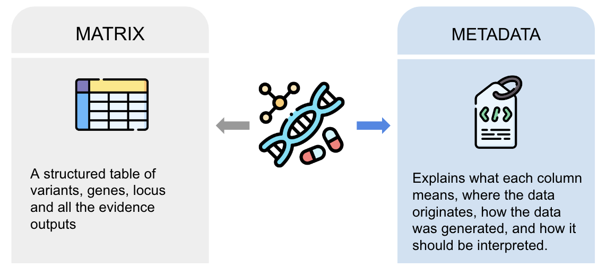

# PEG Evidence Matrix - PEG Metadata - PEG List

## The relationship between the PEG Evidence matrix and PEG metadata

The PEG Evidence Matrix and PEG Metadata tell the same story, about the same actors, but from different perspectives. The matrix describes what each actor does in the story, while the metadata reveals their appearance and personality, adding depth and context to their role.

In practice:

* The matrix is the data itself — a structured table of variants, genes, and all the evidence linking them. It is what you see and analyse.
* The metadata is the description of that data — it explains what each column means, where the data originates, how the data was generated, and how it should be interpreted.

Think of the matrix as the content, and the metadata as the user guide. One without the other is incomplete:
- Without the matrix, there is no information to work with.
- Without the metadata, the matrix is hard to interpret and risks being misunderstood.
Together, they ensure that PEG data is both rich in content and clear in meaning.

## The relationship between the PEG Evidence matrix and PEG list
