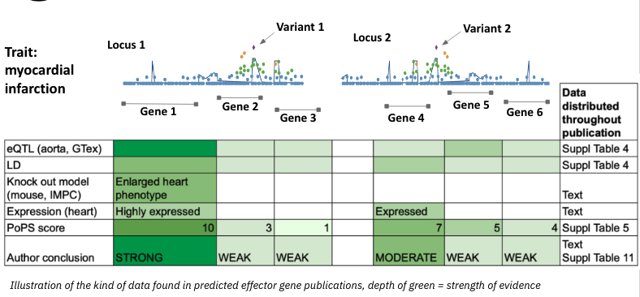

# Toy Data (PEGASUS Framework applied)🎠 

## Toy data
This toy data is an illustration of the type of data commonly found in PEG publications. It shows two loci identified by lead associations from a GWAS for the trait myocardial infarction. Each locus contains multiple nearby candidate effector genes (Gene 1–6).

The bottom table summarises the supporting evidence for each gene — including eQTLs, predicted functional impact, gene expression in aorta, gene prioritisation scores generated by PoPS, and the authors’ overall conclusion.

Importantly, in publications this type of evidence is often scattered across the main text and multiple supplementary tables, making it difficult to compare, integrate, or reproduce.

## PEGASUS Evidence Matrix

In the PEGASUS Evidence Matrix, we propose presenting all evidence in a single structured table. The following table illustrates how the same information can be reformatted into a unified matrix.

<table class="peg-schema">
  <thead>
    <tr>
      <th class="center vc-group">Primary Variant ID</th>
      <th class="center vc-group">rsID</th>
      <th class="center gc-group">Gene ID</th>
      <th class="center gc-group">Gene symbol</th>
      <th class="center lo-group">Locus range</th>
      <th class="center lo-group">Locus ID</th>
      <th class="center vc-group">GWAS_pvalue</th>
      <th class="center vc-group">FUNC_CADD</th>
      <th class="center vc-group">QTL_eQTL_aorta_pvalue</th>
      <th class="center gc-group">EXP_aorta_RPKM</th>
      <th class="center gc-group">PERTURB_mouse</th>
      <th class="center int-group">INT_pops</th>
      <th class="center int-group">INT_Combined prediction (author score)</th>
    </tr>
  </thead>
  <tbody>
    <tr>
      <td>chr1:100000:T:C</td>
      <td>rs1234</td>
      <td>ENSG00000000001</td>
      <td>Gene 1</td>
      <td>chr1:99500-115000</td>
      <td>rs1234</td>
      <td>4.00E-09</td>
      <td>18.2</td>
      <td>7.00E-07</td>
      <td>8.7</td>
      <td>enlarged heart &#124; increased heart weight</td>
      <td>10</td>
      <td><b>STRONG</b></td>
    </tr>
    <tr>
      <td>chr1:100000:T:C</td>
      <td>rs1234</td>
      <td>ENSG00000000002</td>
      <td>Gene 2</td>
      <td>chr1:99500-115000</td>
      <td>rs1234</td>
      <td>4.00E-09</td>
      <td>3.45</td>
      <td>0.01</td>
      <td>NA</td>
      <td>NA</td>
      <td>3</td>
      <td>WEAK</td>
    </tr>
    <tr>
      <td>chr1:100000:T:C</td>
      <td>rs1234</td>
      <td>ENSG00000000003</td>
      <td>Gene 3</td>
      <td>chr1:99500-115000</td>
      <td>rs1234</td>
      <td>4.00E-09</td>
      <td>6.4</td>
      <td>0.05</td>
      <td>NA</td>
      <td>NA</td>
      <td>1</td>
      <td>WEAK</td>
    </tr>
    <tr>
      <td>chr2:20000:A:G</td>
      <td>rs5432</td>
      <td>ENSG00000000004</td>
      <td>Gene 4</td>
      <td>chr2:19000-21000</td>
      <td>rs5432</td>
      <td>3.00E-08</td>
      <td>15.62</td>
      <td>8.00E-05</td>
      <td>1.3</td>
      <td>NA</td>
      <td>7</td>
      <td>MODERATE</td>
    </tr>
    <tr>
      <td>chr2:20000:A:G</td>
      <td>rs5432</td>
      <td>ENSG00000000005</td>
      <td>Gene 5</td>
      <td>chr2:19000-21000</td>
      <td>rs5432</td>
      <td>3.00E-08</td>
      <td>2.13</td>
      <td>0.2</td>
      <td>NA</td>
      <td>NA</td>
      <td>5</td>
      <td>WEAK</td>
    </tr>
    <tr>
      <td>chr2:20000:A:G</td>
      <td>rs5432</td>
      <td>ENSG00000000006</td>
      <td>Gene 6</td>
      <td>chr2:19000-21000</td>
      <td>rs5432</td>
      <td>3.00E-08</td>
      <td>4.4</td>
      <td>0.05</td>
      <td>NA</td>
      <td>NA</td>
      <td>4</td>
      <td>WEAK</td>
    </tr>
  </tbody>
</table>

## PEGASUS List

The PEGASUS List distils the matrix into a concise summary, highlighting the strongest candidate gene at each locus. The PEGASUS List Foundational model records whether evidence was considered (tick = data present, blank = not assessed) and reflects the author’s integrated conclusions for top genes. 

<table class="peg-schema">
  <thead>
    <tr>
      <th rowspan="2">rsID</th>
      <th rowspan="2">Gene symbol</th>
      <th class="center vc-group" colspan="3">Variant-centric</th>
      <th class="center gc-group" colspan="2">Gene-centric</th>
      <th rowspan="2">INT_Combined prediction   (author score)</th>
    </tr>
    <tr>
      <th class="center">GWAS</th>
      <th class="center">FUNC</th>
      <th class="center">QTL</th>
      <th class="center">EXP</th>
      <th class="center">PERTUB</th>
    </tr>
  </thead>
  <tbody>
    <tr>
      <td class="fmt">rs1234</td>
      <td>Gene 1</td>
      <td class="chk"><input type="checkbox" checked disabled aria-label="GWAS present" /></td>
      <td class="chk"><input type="checkbox" checked disabled aria-label="FUNC present" /></td>
      <td class="chk"><input type="checkbox" checked disabled aria-label="QTL present" /></td>
      <td class="chk"><input type="checkbox" checked disabled aria-label="EXP present" /></td>
      <td class="chk"><input type="checkbox" checked disabled aria-label="PERTUB present" /></td>
      <td class="fmt">STRONG</td>
    </tr>
    <tr>
      <td class="fmt">rs5432</td>
      <td>Gene 4</td>
      <td class="chk"><input type="checkbox" checked disabled aria-label="GWAS present" /></td>
      <td class="chk"><input type="checkbox" checked disabled aria-label="FUNC present" /></td>
      <td class="chk"><input type="checkbox" checked disabled aria-label="QTL present" /></td>
      <td class="chk"><input type="checkbox" checked disabled aria-label="EXP present" /></td>
      <td class="chk"><input type="checkbox" disabled aria-label="PERTUB present" /></td>
      <td class="fmt">MODERATE</td>
    </tr>
  </tbody>
</table>
Tick = data/value present. Blank = not assessed. Ticks do NOT imply supportive vs negative. 

Author conclusions and provenance are summarised here; detailed information for each evidence category is available in the evidence matrix.

## PEGASUS Metadata

PEGASUS Metadata — Provides the detailed context behind the PEGASUS Matrix, recording column definitions, provenance, biosamples, and methods so that PEG evidence is fully interpretable and reproducible. Here, the data is presented in 
* (i) tabular format suitable for submission to a resource or presentation as a supplementary table in a publication and 
* (ii) machine readable format suitable for download from a data resource and re-use in an automated pipeline.   

### PEGASUS Metadata in tabular format (suitable for submission)
import Tabs from '@theme/Tabs';
import TabItem from '@theme/TabItem';

<Tabs groupid="data" queryString="toy-data-tab">
  <TabItem value="desc" label="📂 Dataset description" default>
    <table class="peg-schema">
      <thead>
        <tr>
          <th>peg_source</th>
          <th>gwas_source</th>
          <th>trait_description</th>
          <th>trait_ontology_id</th>
          <th>sample_description</th>
          <th>sample_size</th>
          <th>case_control_study</th>
          <th>sample_ancestry</th>
          <th>sample_ancestry_label</th>
        </tr>
      </thead>
      <tbody>
        <tr>
          <td class="ex">PMID:36357675</td>
          <td class="ex">PMID:36357675</td>
          <td class="ex">Ascorbic acid 3-sulfate levels</td>
          <td class="ex">EFO_0800173</td>
          <td class="ex">6,136 Finnish ancestry individuals</td>
          <td class="ex">6136</td>
          <td class="ex">False</td>
          <td class="ex">Finland</td>
          <td class="ex">European</td>
        </tr>
      </tbody>
    </table>
  </TabItem>

  <TabItem value="identifier" label="🧬 Genomic Identifier tab">
    <table class="peg-schema">
      <thead>
        <tr>
          <th>variant_type</th>
          <th>genome_build</th>
          <th>variant_information</th>
          <th>gene_id_source_version</th>
          <th>gene_symbol_source_version</th>
          <th>info</th>
          <th>locus_type</th>
          <th>locus_id</th>
          <th>locus_info</th>
        </tr>
      </thead>
      <tbody>
        <tr>
          <td>lead</td>
          <td>GRCh38</td>
          <td>The primary variant is the variant with the most significant association p-value in the study</td>
          <td>Ensembl v109</td>
          <td>HGNC 2025-07-30</td>
          <td>NA</td>
          <td>LD</td>
          <td>Lead SNP</td>
          <td>NA</td>
        </tr>
      </tbody>
    </table>
  </TabItem>
  
  <TabItem value="evidence" label="🔎 Evidence tab">
    <table class="peg-schema">
      <thead>
        <tr>
          <th>column_header</th>
          <th>column_description</th>
          <th>stream_name</th>
          <th>category</th>
          <th>category_abbreviation</th>
          <th>class</th>
          <th>source_tag</th>
          <th>method_tag</th>
          <th>threshold</th>
          <th>notes</th>
        </tr>
      </thead>
      <tbody>
        <tr>
          <td>GWAS_pvalue</td>
          <td>Association p-value for each variant from the GWAS study</td>
          <td>GWAS</td>
          <td>Genome-wide association (GWAS) signal</td>
          <td>GWAS</td>
          <td>variant-centric</td>
          <td>NA</td>
          <td>NA</td>
          <td>NA</td>
          <td>NA</td>
        </tr>
        <tr>
          <td>FUNC_CADD</td>
          <td>CADD score representing the predicted functional impact of the variant</td>
          <td>FUNC</td>
          <td>Predicted functional impact</td>
          <td>FUNC</td>
          <td>variant-centric</td>
          <td>source_cadd</td>
          <td>NA</td>
          <td>NA</td>
          <td>NA</td>
        </tr>
        <tr>
          <td>QTL_eQTL_aorta_pvalue</td>
          <td>p-value from expression QTL (eQTL) analysis in aorta tissue</td>
          <td>eQTL</td>
          <td>Molecular QTL</td>
          <td>QTL</td>
          <td>variant-centric</td>
          <td>source_gtex_aorta_qtl</td>
          <td>soft_fastqtl</td>
          <td>qvalue &lt; 0.05</td>
          <td>NA</td>
        </tr>
        <tr>
          <td>EXP_aorta_RPKM</td>
          <td>Gene expression level in aorta tissue, measured in RPKM</td>
          <td>EXP</td>
          <td>Expression</td>
          <td>EXP</td>
          <td>gene-centric</td>
          <td>source_gtex_aorta_rna</td>
          <td>NA</td>
          <td>NA</td>
          <td>NA</td>
        </tr>
        <tr>
          <td>PERTURB_mouse</td>
          <td>Phenotypic effects of the gene from IMPC knockout mouse models</td>
          <td>PERTURB</td>
          <td>Perturbation</td>
          <td>PERTURB</td>
          <td>gene-centric</td>
          <td>source_impc</td>
          <td>NA</td>
          <td>NA</td>
          <td>NA</td>
        </tr>
      </tbody>
    </table>
  </TabItem>

  <TabItem value="integration" label="🔗 Integration tab">
    <table class="peg-schema">
      <thead>
        <tr>
          <th>column_header</th>
          <th>column_description</th>
          <th>integration_analysis</th>
          <th>evidence_stream_name</th>
          <th>integrated_analysis_name</th>
          <th>method_tag</th>
          <th>threshold</th>
          <th>notes</th>
        </tr>
      </thead>
      <tbody>
        <tr>
          <td>INT_pops</td>
          <td>Integrated score based on multiple evidence types for the prioritised gene</td>
          <td>pops</td>
          <td>FUNC | eQTL | pQTL | FM | 3D | PHEWAS | TWAS</td>
          <td>NA</td>
          <td>soft_pops</td>
          <td>score &gt; 3</td>
          <td>NA</td>
        </tr>
        <tr>
          <td>INT_Combined prediction (author score)</td>
          <td>Combined prediction based on manual review of all evidence types and PoPS output</td>
          <td>author_score</td>
          <td>PROX | REG | LIT | PoPS</td>
          <td>pops</td>
          <td>method_customised</td>
          <td>NA</td>
          <td>NA</td>
        </tr>
      </tbody>
    </table>
  </TabItem>  
</Tabs>

<Tabs groupid="reference" queryString="toy-reference-tab">
  <TabItem value="source" label="📚 Source tab">
    

    <table className="peg-schema">
      <thead>
        <tr>
          <th>source_tag</th>
          <th>provenance</th>
          <th>file_name</th>
          <th>version</th>
          <th>url</th>
          <th>accesstion</th>
          <th>doi</th>
          <th>tissue</th>
          <th>sample_origin</th>
          <th>cell_type</th>
          <th>cell_line</th>
          <th>disease</th>
          <th>life_stage</th>
          <th>treatment</th>
          <th>sex</th>
          <th>age</th>
          <th>species</th>
          <th>description</th>
        </tr>
      </thead>
      <tbody>
        <tr>
          <td>source_cadd</td>
          <td>CADD</td>
          <td class="break">All possible SNVs of GRCh38/hg38 incl. all annotations</td>
          <td>v1.7</td>
          <td><a href="https://kircherlab.bihealth.org/download/CADD/v1.7/GRCh38/whole_genome_SNVs.tsv.gz">link</a></td>
          <td>NA</td>
          <td>NA</td>
          <td>NA</td>
          <td>NA</td>
          <td>NA</td>
          <td>NA</td>
          <td>NA</td>
          <td>NA</td>
          <td>NA</td>
          <td>NA</td>
          <td>NA</td>
          <td>NA</td>
          <td>NA</td>
        </tr>
        <tr>
          <td>source_gtex_eqtl</td>
          <td>GTEx</td>
          <td class="break">GTEx_Analysis_v10_eQTL.tar</td>
          <td>v10</td>
          <td><a href="https://storage.googleapis.com/adult-gtex/bulk-qtl/v10/single-tissue-cis-qtl/GTEx_Analysis_v10_eQTL.tar">link</a></td>
          <td>NA</td>
          <td>NA</td>
          <td>aorta</td>
          <td>primary tissue</td>
          <td>NA</td>
          <td>NA</td>
          <td>healthy</td>
          <td>adult</td>
          <td>None</td>
          <td>mixed</td>
          <td>mixed</td>
          <td>Homo sapiens</td>
          <td>
             

               
Bulk aorta tissue

Samples from healthy adult human donors in GTEx v10.  Used for eQTL discovery. Donors aged ~20–70 years, male and female.

            

          </td>
        </tr>
        <tr>
          <td>source_gtex_aorta_RNA</td>
          <td>GTEx</td>
          <td class="break">GTEx_Analysis_v10_RNASeQCv2.4.2_gene_tpm.gct.gz</td>
          <td>v10</td>
          <td><a href="https://storage.googleapis.com/adult-gtex/bulk-gex/v10/rna-seq/GTEx_Analysis_v10_RNASeQCv2.4.2_gene_tpm.gct.gz">link</a></td>
          <td>NA</td>
          <td>NA</td>
          <td>aorta</td>
          <td>primary tissue</td>
          <td>NA</td>
          <td>NA</td>
          <td>healthy</td>
          <td>adult</td>
          <td>None</td>
          <td>mixed</td>
          <td>mixed</td>
          <td>Homo sapiens</td>
          <td>
             

               
Bulk aorta tissue

samples (GTEx v10) from healthy postmortem adult human donors in GTEx v10. Used for RNA expression profiling. Donors aged ~20–70 years, male and female. 

             

          </td>
        </tr>
        <tr>
          <td>source_impc</td>
          <td>IMPC</td>
          <td class="break">IMPC_genotype_phenotype.csv.gz</td>
          <td>23</td>
          <td><a href="https://ftp.ebi.ac.uk/pub/databases/impc/all-data-releases/release-01.0/csv/">link</a></td>
          <td>NA</td>
          <td>NA</td>
          <td>multiple</td>
          <td>IMPC mouse knockout models</td>
          <td>NA</td>
          <td>NA</td>
          <td>NA</td>
          <td>mixed</td>
          <td>gene knockout</td>
          <td>mixed</td>
          <td>mixed</td>
          <td>Mus musculus</td>
          <td>Mice with single-gene knockouts generated by the IMPC project.</td>
        </tr>
      </tbody>
    </table>
    

  </TabItem>

  <TabItem value="method" label="⚙️ Method tab">
    <table class="peg-schema">
      <thead>
        <tr>
          <th>method_tag</th>
          <th>method_mode</th>
          <th>software_name</th>
          <th>software_version</th>
          <th>software_url</th>
          <th>software_doi</th>
          <th>method_description</th>
        </tr>
      </thead>
      <tbody>
        <tr>
          <td>soft_fastqtl</td>
          <td>computational</td>
          <td>FastQTL</td>
          <td>v1.0</td>
          <td><a href="https://github.com/francois-a/fastqtl">link</a></td>
          <td>10.1093/BIOINFORMATICS/BTV722</td>
          <td>NA</td>
        </tr>
        <tr>
          <td>soft_pops</td>
          <td>computational</td>
          <td>PoPS</td>
          <td>v1.0</td>
          <td><a href="https://github.com/FinucaneLab/pops">link</a></td>
          <td>10.1038/s41588-023-01443-6</td>
          <td>NA</td>
        </tr>
        <tr>
          <td>method_customise</td>
          <td>manual</td>
          <td>NA</td>
          <td>NA</td>
          <td>NA</td>
          <td>NA</td>
          <td>
            

               
An integrated prediction

               
derived from expert review of all evidence types together with PoPS output. The strength of support for a gene is classified as <b>weak</b>, <b>medium</b>, or <b>strong</b> based on professional judgement: 
               • <b>Weak</b> — variant-centric evidence does not support the gene. 
               • <b>Medium</b> — variant-centric evidence supports the gene, but gene-centric evidence is lacking. 
               • <b>Strong</b> — both variant-centric and gene-centric evidence show consistent positive support for the gene.

            

          </td>
        </tr>
      </tbody>
    </table>
  </TabItem>
</Tabs> 

### PEGASUS Metadata in YAML (suitable for reader)
Using YAML for metadata keeps all information on one page in a structured format, so users can easily search and extract the details they need, and is both human and machine-readable. 

import BrowserOnly from '@docusaurus/BrowserOnly';
import CodeBlock from '@theme/CodeBlock';

  
Show YAML file

  <BrowserOnly>
    {() => {
      const React = require('react');
      const useBaseUrl = require('@docusaurus/useBaseUrl').default;
      // 1) File must live at: <repo>/static/samples/peg_metadata.yaml
      //    It will be served at: <baseUrl>/samples/peg_metadata.yaml
      const url = useBaseUrl('/samples/peg_metadata.yaml');
      const [text, setText] = React.useState('Loading…');
      React.useEffect(() => {
        // 2) Cache-bust to avoid stale content during dev or Pages CDN
        const bust = url + (url.includes('?') ? '&' : '?') + 'v=' + Date.now();
        fetch(bust)
          .then((r) => (r.ok ? r.text() : Promise.reject(r.status)))
          .then(setText)
          .catch(() => setText('Failed to load YAML'));
      }, [url]);
      return (
        <>
          

            Source:&nbsp;
            <a href={url} target="_blank" rel="noopener noreferrer">{url}</a>
          

          <CodeBlock language="yaml" title="peg_metadata.yaml">
            {text}
          </CodeBlock>
        </>
      );
    }}
  </BrowserOnly>

